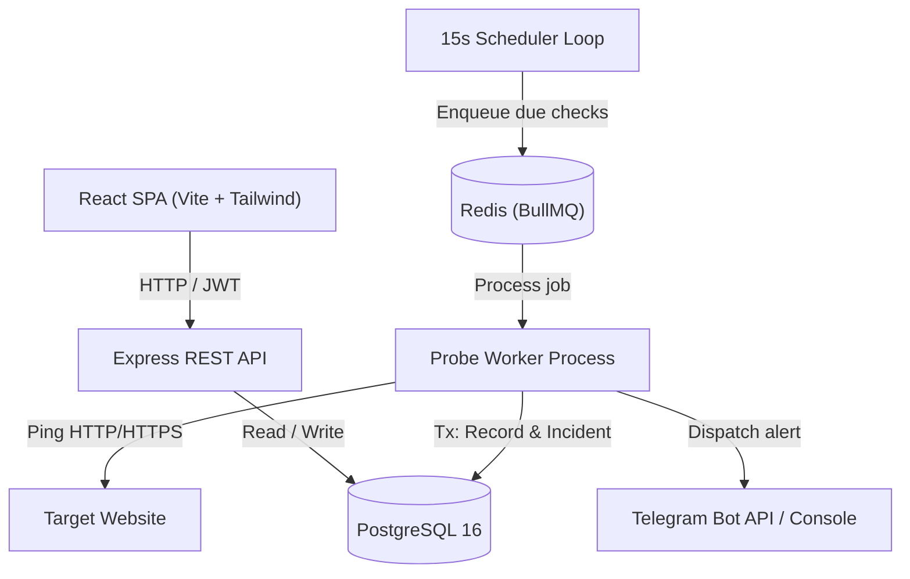

# Architecture & Design Decisions

This document provides a concise architectural overview of the **Uptime Monitor** system.

---

## System Overview

The system separates client-facing HTTP operations from background health probes:
1. **API Server (`backend/src/index.ts`):** Handles authentication, monitor configuration CRUD, and telemetry queries.
2. **Worker Process (`backend/src/worker/worker.ts`):** A standalone background service that polls for due checks and processes HTTP probes asynchronously.
3. **Database (`schema.sql`):** PostgreSQL 16 with relational foreign keys and cascading deletes.
4. **Task Queue (`backend/src/queue/queue.ts`):** Redis 7 and BullMQ for reliable, deduplicated background execution.
5. **Dashboard (`frontend/`):** Lightweight Single-Page App built with Vite, React, TypeScript, and Tailwind CSS.

---

## State Transition Decision Table

Health probe results are evaluated inside a PostgreSQL transaction (`BEGIN ... COMMIT`) using the following decision matrix:

| Open Incident Exists? | Current Check Result | Action Taken |
| :---: | :---: | :--- |
| **No** | **UP** (2xx) | No action. Service remains healthy. |
| **No** | **DOWN** (Non-2xx / timeout) | **INSERT** new row into `incidents` (`ended_at = NULL`). Send **DOWN** alert once. |
| **Yes** | **DOWN** | No action. Outage is ongoing; duplicate alerts are suppressed. |
| **Yes** | **UP** (2xx) | **UPDATE** open incident (`ended_at = NOW()`). Send **RECOVERY** alert once. |

After every check:
1. A row is inserted into `check_results` (`is_up`, `status_code`, `response_ms`, `error`).
2. `monitors.last_checked_at` is updated to `NOW()`.

---

## Design Decisions

### 1. Dedicated Worker Process vs In-Process Scheduler
Long-running HTTP probes and network timeouts (up to 10s) must never block the API event loop. Running the probe worker as an independent process ensures API responsiveness under high monitoring load and allows the worker to scale independently.

### 2. Job Deduplication via `jobId`
In BullMQ, jobs are queued with `jobId = "monitor-<id>"`. If a target website is slow to respond, subsequent scheduler iterations will not queue duplicate jobs for the same monitor while one is already pending or active.

### 3. Composite Index on `check_results(monitor_id, checked_at)`
Dashboard queries filter telemetry by `monitor_id` within a time window (e.g. last 24 hours or 30 days) and order results descending by timestamp. A composite B-tree index on `(monitor_id, checked_at)` allows PostgreSQL to perform an efficient index scan rather than scanning the entire table.

### 4. Open Incidents Represented by `ended_at IS NULL`
Instead of maintaining a separate status enum that can become out of sync, an incident is active if and only if `ended_at` is `NULL`. Resolving the outage sets `ended_at = NOW()`, calculating total downtime (`ended_at - started_at`).
