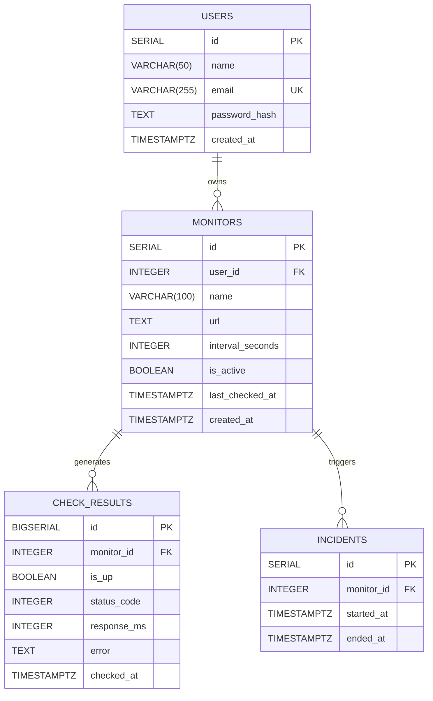
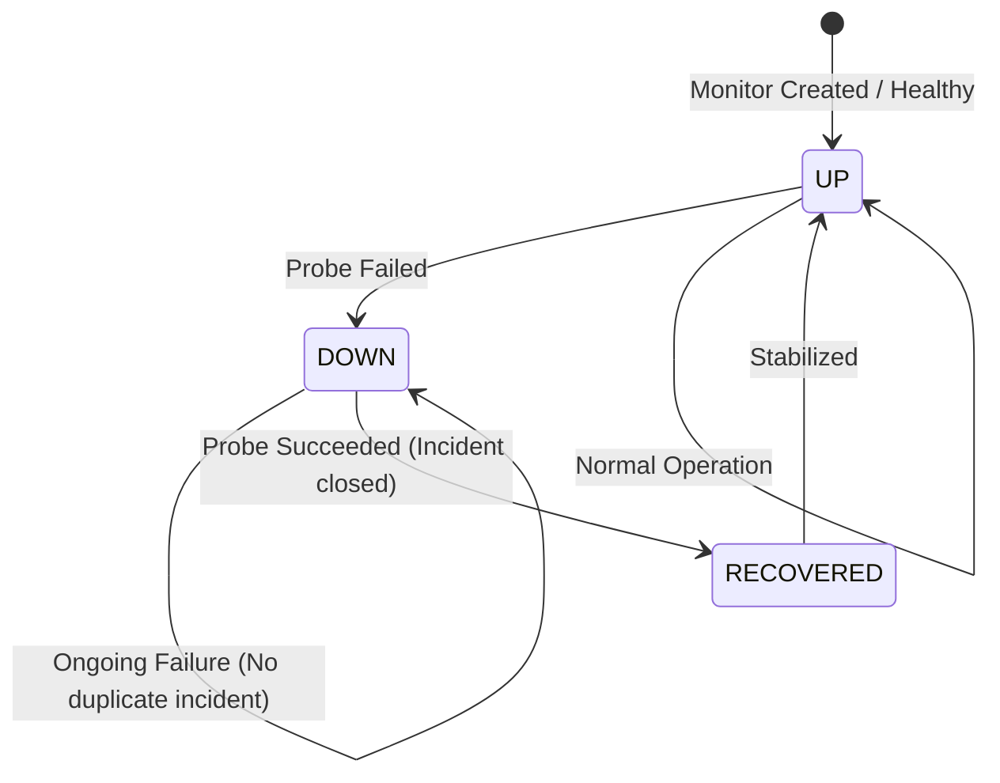

# Database Architecture & Scaling Design

This document details the relational database schema, indexing strategies, time-series query optimizations, and scale-out retention policies designed for the **Uptime Monitor** platform.

---

## 1. Entity-Relationship Model (ERD)

The data model is engineered as a normalized 4-table relational architecture with referential integrity constraints and cascading deletions to guarantee consistent state management.



---

## 2. Table Specifications & Schema Definitions

### `users`
Stores user identities, credentials, and ownership boundaries.
- **`id`** (`SERIAL PRIMARY KEY`): Unique user identifier.
- **`name`** (`VARCHAR(50) NOT NULL`): User display name.
- **`email`** (`VARCHAR(255) NOT NULL UNIQUE`): Unique login identifier with a unique B-tree index.
- **`password_hash`** (`TEXT NOT NULL`): Salted bcrypt password hash.
- **`created_at`** (`TIMESTAMPTZ NOT NULL DEFAULT NOW()`): Registration timestamp.

### `monitors`
Stores probe targets and frequency configurations.
- **`id`** (`SERIAL PRIMARY KEY`): Unique monitor identifier.
- **`user_id`** (`INTEGER NOT NULL REFERENCES users(id) ON DELETE CASCADE`): Owner identifier. Cascades when a user account is deleted.
- **`name`** (`VARCHAR(100) NOT NULL`): Human-readable monitor name.
- **`url`** (`TEXT NOT NULL`): Target HTTP/HTTPS endpoint.
- **`interval_seconds`** (`INTEGER NOT NULL`): Check frequency enforced by `CHECK (interval_seconds IN (60, 3600, 86400))` (1 min, 1 hour, 1 day).
- **`is_active`** (`BOOLEAN NOT NULL DEFAULT TRUE`): Toggles whether the worker scheduler enqueues probes for this target.
- **`last_checked_at`** (`TIMESTAMPTZ`): Timestamp of the most recent probe execution.
- **`created_at`** (`TIMESTAMPTZ NOT NULL DEFAULT NOW()`): Creation timestamp.

### `check_results`
High-throughput, append-only time-series telemetry table recording the outcome of every probe.
- **`id`** (`BIGSERIAL PRIMARY KEY`): 64-bit auto-incrementing identifier preventing integer overflow at scale.
- **`monitor_id`** (`INTEGER NOT NULL REFERENCES monitors(id) ON DELETE CASCADE`): Associated monitor.
- **`is_up`** (`BOOLEAN NOT NULL`): Binary health status (`true` = reachable with 2xx/3xx, `false` = unreachable or 4xx/5xx).
- **`status_code`** (`INTEGER`): HTTP status code returned (e.g., 200, 404, 500), or `NULL` on DNS/network timeouts.
- **`response_ms`** (`INTEGER`): Round-trip latency measured in milliseconds.
- **`error`** (`TEXT`): Diagnostic error message if the check timed out or failed.
- **`checked_at`** (`TIMESTAMPTZ NOT NULL DEFAULT NOW()`): Precision timestamp of the probe.

### `incidents`
Lifecycle tracking for confirmed service outages.
- **`id`** (`SERIAL PRIMARY KEY`): Incident identifier.
- **`monitor_id`** (`INTEGER NOT NULL REFERENCES monitors(id) ON DELETE CASCADE`): Target monitor.
- **`started_at`** (`TIMESTAMPTZ NOT NULL`): Timestamp when the outage began.
- **`ended_at`** (`TIMESTAMPTZ`): Timestamp when recovery was confirmed. Open incidents have `ended_at IS NULL`.

---

## 3. Indexing Strategy & Sub-Millisecond Time-Series Optimization

### Composite Index Design
```sql
CREATE INDEX idx_check_results_monitor_time
  ON check_results (monitor_id, checked_at);
```

### Technical Rationale:
1. **Query Access Pattern**: The most frequent time-series query across the system is retrieving recent telemetry for a given monitor:
   ```sql
   SELECT checked_at, is_up, response_ms, status_code
   FROM check_results
   WHERE monitor_id = $1
   ORDER BY checked_at DESC
   LIMIT 100;
   ```
2. **Execution Plan & B-Tree Structure**:
   - `monitor_id` acts as the primary partition key in the composite index, allowing Postgres to perform an equality seek to the exact sub-tree.
   - `checked_at` forms the second level of the B-tree, enabling a pre-sorted backward scan for `ORDER BY checked_at DESC`.
   - **Performance Result**: Execution cost drops from an $O(N)$ sequential scan across millions of rows to an $O(\log N)$ index seek, achieving **sub-millisecond (<1ms) query execution**.

---

## 4. Scaling Architecture & 40M+ Rows/Month Retention Design

### Mathematical Volume Projection
For an operational baseline of **1,000 active monitors** configured at the minimum 60-second probe interval:

$$\text{Checks per minute} = 1,000$$
$$\text{Checks per hour} = 1,000 \times 60 = 60,000$$
$$\text{Checks per day} = 60,000 \times 24 = 1,440,000$$
$$\text{Checks per month (30 days)} = 1,440,000 \times 30 = \mathbf{43,200,000\text{ rows/month}}$$

At an estimated average row storage footprint of ~95–110 bytes (including index overhead), telemetry accumulates at **~4.5 GB to 5.0 GB per month**.

### Scalability Bottlenecks of Unpartitioned Tables
- Single-table growth leads to index bloat, reduced buffer cache hit ratios, and degrading query latencies.
- Standard row-by-row pruning (`DELETE FROM check_results WHERE checked_at < NOW() - INTERVAL '30 days'`) triggers massive Write-Ahead Log (WAL) amplification, lock contention, and autovacuum degradation.

### Planned Mitigation Strategies

#### 1. Range Partitioning by Timestamp
Partition the `check_results` table by month using PostgreSQL native declarative partitioning:
```sql
CREATE TABLE check_results (
    id BIGSERIAL,
    monitor_id INTEGER NOT NULL REFERENCES monitors(id) ON DELETE CASCADE,
    is_up BOOLEAN NOT NULL,
    status_code INTEGER,
    response_ms INTEGER,
    error TEXT,
    checked_at TIMESTAMPTZ NOT NULL DEFAULT NOW(),
    PRIMARY KEY (id, checked_at)
) PARTITION BY RANGE (checked_at);
```

#### 2. Instantaneous Partition Dropping ($O(1)$)
When telemetry ages beyond the configured retention threshold (e.g., 30 or 90 days), entire historical partition tables are dropped:
```sql
DROP TABLE check_results_y2026m08;
```
- **Advantages**: $O(1)$ instantaneous metadata operation, zero vacuum overhead, zero WAL bloat.

#### 3. Continuous Rollup Aggregations
Before dropping raw second-by-second telemetry, hourly aggregates are computed and persisted into an `uptime_hourly_rollups` summary table:
```sql
CREATE TABLE check_results_hourly_rollup (
    monitor_id INTEGER NOT NULL REFERENCES monitors(id) ON DELETE CASCADE,
    bucket_hour TIMESTAMPTZ NOT NULL,
    total_checks INTEGER NOT NULL,
    successful_checks INTEGER NOT NULL,
    avg_response_ms INTEGER,
    p95_response_ms INTEGER,
    PRIMARY KEY (monitor_id, bucket_hour)
);
```
This enables multi-year historical SLA and uptime percentage reporting with minimal disk footprint.

---

## 5. Alert State Machine & Incident Deduplication

To avoid alert storms and notification fatigue, the monitoring engine uses a state machine to track transitions:



1. **State: Healthy (`UP`)**:
   - Probe passes: update `last_checked_at` and log `check_results`.
   - Probe fails: transition to `DOWN`. Execute insert into `incidents (monitor_id, started_at, ended_at) VALUES ($1, NOW(), NULL)`. Dispatch downtime notification.
2. **State: Down (`DOWN`)**:
   - Probe continues to fail: log `check_results`. An open incident (`ended_at IS NULL`) already exists, suppressing duplicate notifications.
   - Probe passes: transition to `RECOVERED`. Update open incident: `UPDATE incidents SET ended_at = NOW() WHERE monitor_id = $1 AND ended_at IS NULL`. Dispatch recovery notification.
